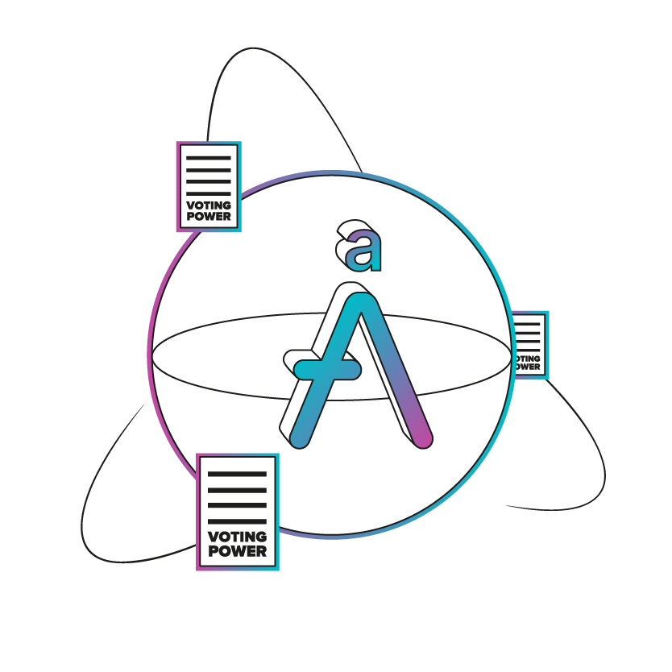

# $aAAVE - Delegation compatible

 

Next iteration of the aAAVE token (Aave v3), optimized for its usage as voting asset on Aave Governance v3.

In addition to the inherited implementation from Aave v3, the new logic on aAAVE respects the same properties as the new AAVE token, which can be found [HERE](https://github.com/bgd-labs/aave-token-v3/blob/main/properties.md)

 

## Setup

This repository requires having Foundry installed in the running machine. Instructions on how to do it [HERE](https://github.com/foundry-rs/foundry#installation).

After having installed Foundry:
1. Add a `.env` file with properly configured `RPC_MAINNET`, following the example on `.env.example`
2. `make test` to run the simulation tests.

 

## Security

- Internal testing and review by the BGD Labs team, but in terms of logic and upgradeability considerations.
    - [Test suite](./tests/)
    - [Storage layout and code diffs](./diffs/)
- Security review and properties checking (formal verification) by [Certora](https://www.certora.com/), service provider of the Aave DAO.
    - [Properties](./certora/)
    - [Reports](./certora/reports/Formal_Verification_Report_aAAVE_With_Delegation.pdf)
- Audit by [MixBytes](https://mixbytes.io/).
  - [Reports](./audits/MixBytes_audit_Report_gov_v3_voting_assets.pdf)

 

## Copyright

Copyright © 2023, Aave DAO, represented by its governance smart contracts.

Created by [BGD Labs](https://bgdlabs.com/).

[MIT license](./LICENSE)
